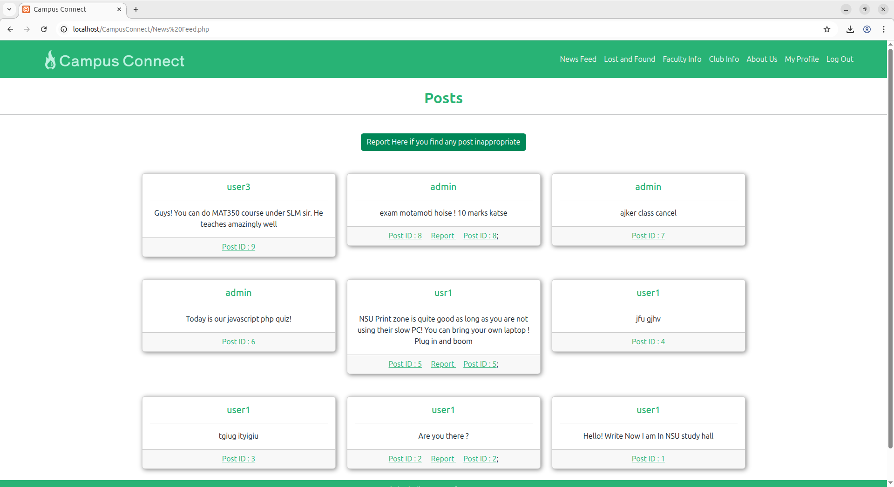
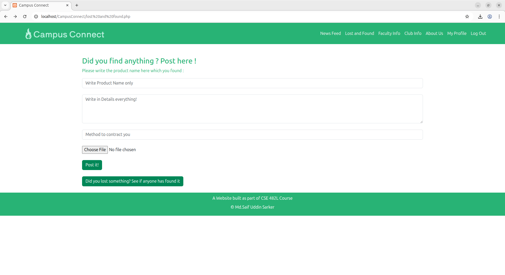
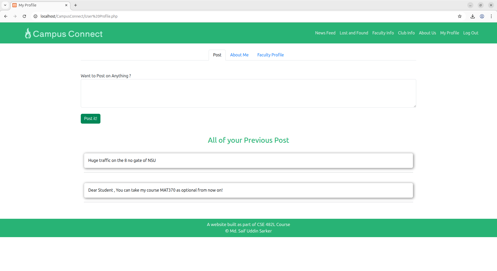

# CampusConnect

A full-stack campus social networking platform built with PHP and MySQL, designed to connect students, faculty, and campus communities in one web portal aka Facbook for Campus

---

## Overview

CampusConnect is a web-based platform developed as part of CSE482 course project. Here Student and teacher can post something which will be shown on everyones news feed, 
Teacher can update its contract info , office hour which is viewable by student. There is also module for lost and found .Student can see all the clubs in the varsity.

---


## Overview

CampusConnect is a web-based platform developed as part of the **CSE482 course project**. Here, students and teachers can post updates which are shown on everyone's news feed.  
Teachers can update their contact info and office hours, viewable by students.  
There is also a **Lost & Found** module, and students can see all campus clubs.

## Features

- **User Authentication** — Secure sign-up and login system with session management and logout handling
- **News Feed** — Dynamic post feed where students can share updates, with support for media uploads
- **User Profiles** — Editable student profiles with photo uploads and personal information
- **People Search** — Discover and connect with other students on campus
- **Faculty Directory** — Browse faculty profiles, including an admin-managed faculty information panel
- **Club Information** — Dedicated pages for campus clubs including Athletics, Art & Photography, Cine & Drama, and Communication
- **Lost & Found** — Post and browse lost item reports; activate/resolve found items
- **Reporting System** — Report inappropriate content or users
- **About Us Page** — Institutional information page for the platform

---


## Screenshots

**News Feed**


**Lost and Found**


**User Profile**



------------------

## Project Structure

```
CampusConnect/
├── index.php                  #  login page
├── Sign Up.php                # Registration page
├── signup.php                 # Registration logic
├── logout.php                 # Session termination
├── navbar.php                 # navigation bar
├── News Feed.php              # Main social feed
├── processpost.php            # Post submission handler
├── User Profile.php           # Student profile view
├── User Profile2.php          # Alternate profile view
├── Edit.php                   # Profile editing
├── People found.php           # People search results
├── Faculty info.php           # Faculty directory (student view)
├── Afacultyinfo.php           # Faculty info (admin view)
├── facultylist.php            # Full faculty listing
├── facultyprofile.php         # Individual faculty profile
├── Club Info.php              # Club listing page
├── art & photography.php      # Art & Photography club page
├── athletics.html             # Athletics club page
├── cine and drama.html        # Cine & Drama club page added on club info
├── communication.html         # Communication club page
├── lost and found.php         # Lost & Found board
├── ActivateLost.php           # Mark item as found
├── activatemoredetails.php    # Lost item detail view
├── More details.php           # Extended item details
├── Report.php                 # Content/user reporting about any post
├── About Us.php               # About the platform/builder
├── supplimentarylogin.php     # login handler
├── connect.sql                # Database schema
├── footer.html / footer2.html # Shared footer components
├── 3.css                      
└── uploads/                   # User media
└── screenshot/                #Screenshot of the project used in readme

```

---

## Getting Started

### Prerequisites

- PHP 7.4 or higher
- MySQL 5.7 or higher
- Apache server (recommended via [XAMPP](https://www.apachefriends.org/) or LAMP)

### Installation

1. **Clone the repository**
   ```bash
   gh repo clone saifsami78/CampusConnect
   ```

2. **Move to your server's web root**
   ```bash
   # For XAMPP on Windows
   paste the whole folder on htdocs 
   ```

3. **Import the database**
   - Open **phpMyAdmin** (`http://localhost/phpmyadmin`)
   - Create a new database named `campusconnect`
   - Import `connect.sql` from the project root

4. **Configure the database connection**
     ```php
     $host = "localhost";
     $user = "root";
     $password = "";
     $database = "campusconnect";
     ```

5. **Run the application**
   - Start Apache and MySQL via XAMPP/LAMP
   - Visit `http://localhost/CampusConnect/index.php` in your browser

---

## License

This project is licensed under the [MIT License](LICENSE).

---

## Author

**Saif Sami**  
GitHub: [@saifsami78](https://github.com/saifsami78)